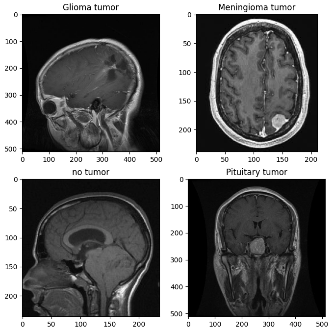
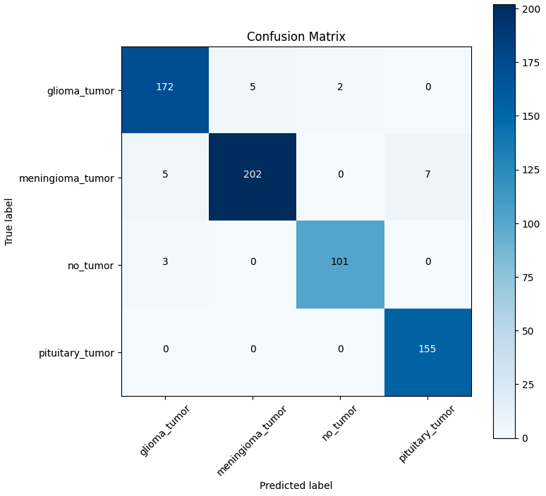

# Brain Tumor Classification

This project is focused on developing an AI-based system for classifying brain tumor images. The goal is to create a tool that can assist in early diagnosis by accurately distinguishing between 4 classes - pituitary tumor, glioma tumor, meningioma tumor, and non-tumor cases using Convolutional Neural Networks.

## Overview

By leveraging deep learning, this project aims to automate and streamline the analysis of brain MRI scans, potentially aiding medical professionals in making timely decisions.

## Dataset

- **Data Description:** The dataset comprises MRI images labeled according to the presence of each of the 3 brain tumors or the absence of brain tumors.

- **Source:** ([Dataset Link](https://www.kaggle.com/datasets/sartajbhuvaji/brain-tumor-classification-mri))

## Technologies Used

- **Programming Language:** Python
- **Notebook Environment:** Jupyter Notebook
- **Deep Learning Framework:** PyTorch
- **Libraries:** NumPy, Pandas, Matplotlib, scikit-learn, etc.

## Results
The model demonstrates promising results in classifying brain tumor images. After training, it achieved an accuracy of 0.97% on the validation set. Detailed metrics and visualizations can be found within the notebook.

## Future Work
- Data Augmentation: Implement additional techniques to increase the dataset size and variability.
- Deployment: Explore deploying the model as a web service for real-time predictions.
- Explainability: Integrate interpretability methods to better understand the model’s decision-making process.
